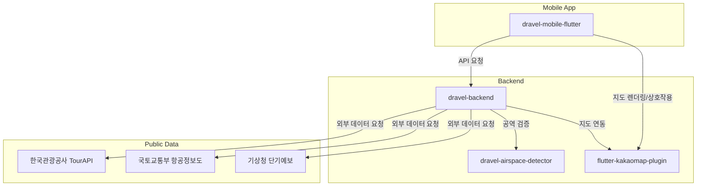

# Dravel

**2024 한국관광데이터 공모전 우수상 수상작**


---

## 서비스 소개

**Dravel**은 드론 촬영을 즐기는 사용자들을 위한 종합 플랫폼입니다. 드론 비행이 가능한 장소(‘드론 스팟’)의 정보와 해당 지역의 공역 및 실시간 날씨 정보를 한눈에 확인할 수 있으며, 사용자의 여행 동선 내에서 숙박, 식당, 관광지 등 다양한 여행 정보를 통합 제공합니다.  
이를 통해 드론 취미자, 촬영 관광객, 전문가 모두가 안전하고 효율적으로 촬영 여행을 계획할 수 있고, 자연스럽게 지역 경제 활성화에도 기여할 수 있습니다.

---

## 서비스 개발 배경

2022년 12월 1일부로 드론 촬영 규제가 완화되어, 국가보안시설이 아닌 지역에서는 별도의 승인 없이 촬영이 가능해졌습니다. 이에 따라 드론을 취미로 삼는 사용자와 영상 촬영 수요가 급증하고 있으며, 여행지에서의 드론 촬영 수요도 증가하고 있습니다.  
**Dravel**은 드론 촬영 허가 정보와 주변 관광 정보를 통합 제공하여 드론 사용자들이 더 쉽고 안전하게 여행과 촬영을 즐기고, 지역 경제에 자연스럽게 기여할 수 있도록 설계된 서비스입니다.

---

## 주요 기능

- **드론 스팟 정보 제공**: 전국의 드론 비행/촬영 허용 장소와 세부 정보를 시각적으로 제공
- **공역 정보 제공**: 국토교통부의 항공정보도(WMS/WFS) 연동을 통해 관제권, 비행금지구역 등 실시간 공역 정보를 안내
- **실시간 날씨 정보**: 기상청의 단기예보 API를 활용한 촬영지별 실시간 기상 정보 제공
- **주변 관광 정보**: 한국관광공사의 관광정보 API를 통해 주변 숙박, 식당, 관광 명소 등 여행 편의 정보 제공
- **코스 추천 기능**: 사용자의 여행·촬영 목적에 맞는 드론 여행 코스 자동 추천
- **정보 공유 및 커뮤니티**: 드론스팟 리뷰, 촬영 경험 공유, 팔로우 등 사용자간 정보 교류 및 커뮤니티 기능 지원

---

## 핵심 구현 내용

- **한국관광공사_국문 관광정보 서비스_GW**  
  주변 숙박, 식당, 관광지 등 여행지 정보를 연동하여 드론 촬영과 여행을 한 번에 계획 가능

- **국토교통부_항공정보도(WMS/WFS)**  
  드론 비행을 위한 공역 정보(관제권, 비행금지 구역 등)를 실시간 지도 기반으로 제공

- **기상청_단기예보 조회서비스**  
  드론 촬영 스팟의 실시간 날씨 정보를 제공하여 안전한 촬영 계획 지원

---

## 서비스 차별점 및 시장성

- **통합 플랫폼**: 드론 스팟, 공역, 날씨, 관광·여행 정보가 유기적으로 연결된 국내 유일의 플랫폼
- **지역 경제 활성화**: 드론 촬영 여행을 통해 지역 식당, 숙박, 관광지 방문 유도
- **드론 커뮤니티 중심**: 리뷰, 경험 공유, 팔로우 기반의 사용자 네트워킹
- **지속 가능 성장**: 사용자 피드백 기반의 서비스 고도화, 프리미엄 구독 서비스, 커뮤니티 활성화 등 단계적 성장 전략

---

## 주요 활용 공공 데이터

- **한국관광공사**: 국문 관광정보 서비스_GW (https://www.data.go.kr/data/15076532/openapi.do)
- **국토교통부**: 항공정보도(WMS/WFS) (https://www.nsic.go.kr/)
- **기상청**: 단기예보 조회서비스 (https://data.kma.go.kr/)

---

## 주 이용 대상

- 드론을 취미로 즐기는 일반 사용자
- 드론 촬영을 하며 여행하는 관광객
- 드론 촬영 전문가 및 콘텐츠 크리에이터

---

## 프로젝트 구조

```
dravel
├── dravel-backend                # Python 기반 백엔드 API 서버
│   └── (드론스팟/공역/날씨/관광 정보 통합 비즈니스 로직)
├── dravel-mobile-flutter         # Flutter 기반 모바일 앱
│   └── (크로스플랫폼, 사용자 UI/UX, 커뮤니티, 리뷰, 추천 등)
├── dravel-airspace-detector      # Python 기반 공역 정보 및 비행 허가 검증 모듈
│   └── (공역 판별, 비행 가능 여부 판단)
└── flutter-kakaomap-plugin       # Flutter용 KakaoMap 연동 플러그인
    └── (드론스팟/공역 지도 시각화, Flutter-KakaoMap 브릿지)
```

> 각 레포지토리의 상세 구조와 역할은 해당 리포의 README 및 소스코드를 참고하세요.

---

## 프로젝트 구조도

아래 다이어그램은 Dravel의 전체 서비스와 데이터 흐름 구조를 간략하게 나타냅니다.



---

## 기여 및 오픈소스 라이선스

Dravel 프로젝트는 오픈소스로 운영되며, 누구나 자유롭게 이슈 제기, 기능 제안, 코드 기여가 가능합니다.  
자세한 내용은 각 레포지토리의 `CONTRIBUTING.md` 및 `LICENSE` 파일을 참고해주세요.

---

## 수상 이력

- **2024 한국관광데이터 공모전 우수상**

---

## 문의

- Email: contact@dravel.kr  
- GitHub Issues를 통해 언제든 문의 및 제안 가능합니다.

---

**당신의 드론 여행, Dravel이 함께합니다!**
